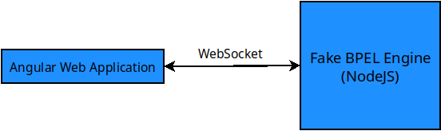
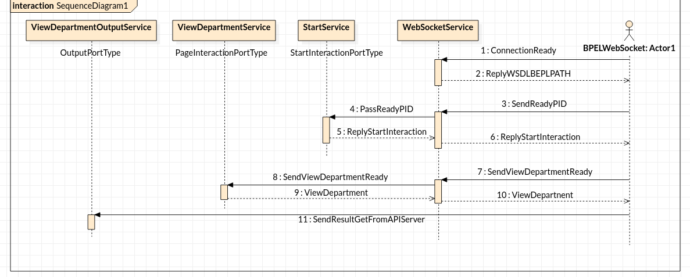

# Inventory System


### 1. Fake BPEL Engine讓我們可以簡單做測試(Message Passing的部份)
* 目前用 Port 3000做Demo
* 開Server 
  * `node ./WebSockerServer/BPELEmulatorServer.js`
* 開Client
  *  `http://localhost:4200/department` 目前只做好viewDepartment
### 2. Message Passing Sequence Diagram



### 3. Message format sent to BPEL
```=javascript
const notificationData = {
    "notification":"CONNECTIONREADY",
    "cid":0
}

const startInteractionData = {
    "notification":"READY",
    "portType": {
        "namespace":"testdata/GetDepartments.bpel",
        "local_name":"startInteractionPort"
    },
    "partnerLink":"Main",
    "pid":0,
    "operation":"start"
}

const unReadyStartInteractionData = {
    "notification":"UNREADY",
    "portType": {
        "namespace":"testdata/GetDepartments.bpel",
        "local_name":"startInteractionPort"
    },
    "partnerLink":"Main",
    "pid":0,
    "operation":"start"
}

const pageInteractionData = {
    "notification":"READY",
    "portType": {
        "namespace":"testdata/GetDepartments.bpel",
        "local_name":"pageInteractionPort"
    },
    "partnerLink":"Main",
    "pid":0,
    "operation":"viewDepartmentList"
}

const outputData = {
    "portType": {
        "namespace":"testdata/GetDepartments.bpel",
        "local_name":"outputPort"
    },
    "partnerLink":"Client",
    "pid":0,
    "type":{
        "namespace":"testdata/GetDepartments.bpel",
        "local_name":"outputPort.output"
    },
    "operation":"output",
    "content":"\n Vehecle<Voutput>\n<VMain.reply>\n"
}
```

### 4. Message format receive from BPEL

```javascript=
const clientDataStart = {
    "bpelPath" : "",
    "wsdlPath" : ""
}

const clientData = {
    "pid" : "",
    "partnerLink" : "",
    "operation": "",
    "portType": {
        "namespace": "",
        "local_name": ""
    },
    "content": ""
}
```

### 5. File Structure of a web application
* Note : Inventory System has multiple web application (multiple Page)